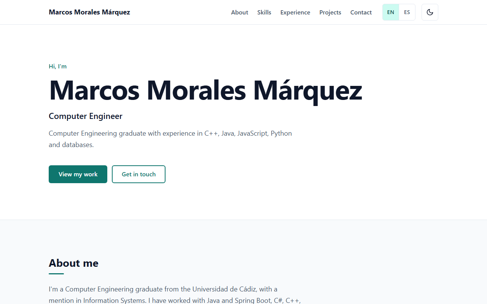
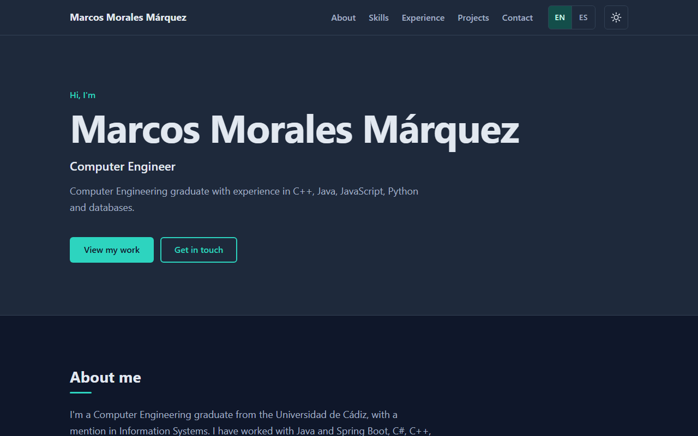

# Portfolio

My personal portfolio website: a single-page static site in English and Spanish, built with plain HTML, CSS and JavaScript and hosted on GitHub Pages.

**Live site:** [English](https://kirtashk.github.io/Portfolio/) · [Español](https://kirtashk.github.io/Portfolio/es/)

<p>
  
  
</p>

## Features

- **Six sections**: hero, about, skills, experience (work and education), projects and contact.
- **Two languages**: English and Spanish as two hand-written pages. The EN | ES switcher keeps you on the section you were reading.
- **Light and dark themes**: follows the system setting on the first visit, remembers your choice afterwards, and never flashes the wrong theme while loading.
- **Sticky navigation**: the header stays in view and highlights the section you are reading.
- **Responsive**: mobile-first layout, with the menu collapsing behind a button on phones and tablets.
- **Accessible**: semantic HTML, a skip link, visible keyboard focus, color contrast that meets WCAG AA in both themes, and reduced motion respected.
- **No dependencies**: no frameworks, no build step and no external requests. Fonts come from the system.

## Structure

```
index.html      English page: markup and visible text
es/index.html   Spanish page: same structure and section ids, Spanish text
styles.css      Design tokens, base styles, then one block per section
theme-init.js   Applies the saved/system theme before first paint
script.js       Small behavior, shared by both pages
assets/         Images and icons
```

Each language is written by hand in its own page. When you add or change a
section, update both `index.html` and `es/index.html`.

All colors are CSS custom properties at the top of `styles.css`, named by role
(`--color-accent`, `--color-surface`...). The dark theme only overrides those
variables.

## Running locally

Serve the folder with any static server so the EN / ES links (which point to
folders like `es/`) work, for example:

```
python -m http.server 5500
```

Then open http://localhost:5500. Opening `index.html` directly also works,
except for switching language.

## Branches

- `main`: the published site
- `develop`: integration branch for ongoing work.
- `feature/*`: one branch per feature, merged into `develop`.
